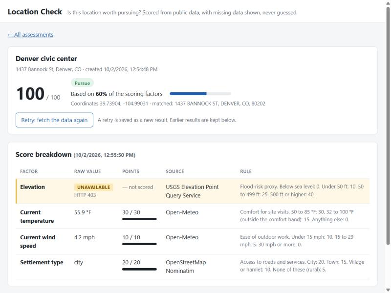
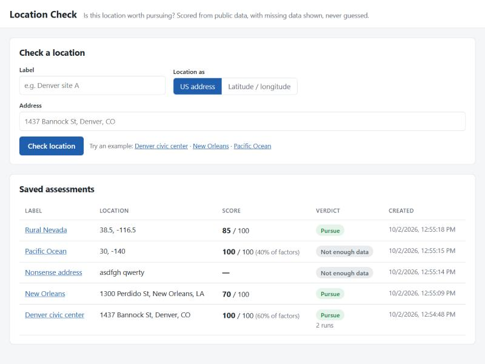
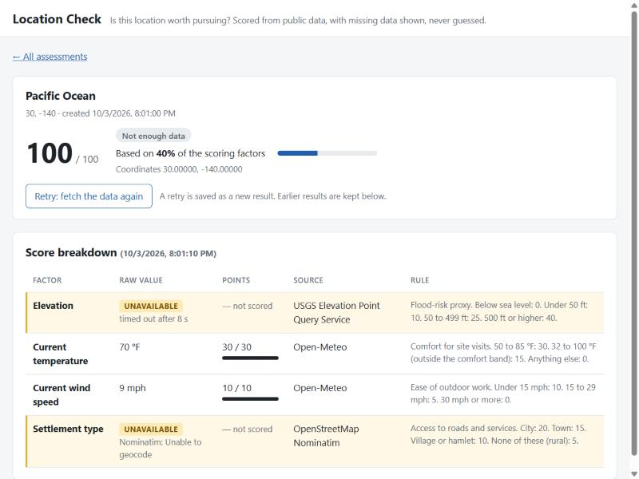

# Location Check: prototype

A small web app that answers "is this location worth pursuing?". You enter a US
address (or a latitude and longitude) and a label. The backend finds the
coordinates, fetches facts about that point from three public data sources,
turns them into a 0–100 score using written-down rules, saves everything in
SQLite, and shows a list of saved assessments and a detail page per assessment.

If a source is slow, down, or returns nonsense, the assessment is still saved
and that factor is shown as **UNAVAILABLE with the reason**. It is never shown
or scored as 0.



| Saved assessments | A real timeout (point in the Pacific Ocean) |
|---|---|
|  |  |

## How to run it

You need Python 3.10+ and Node.js 18+. Use two terminals.

**Terminal 1: backend** (FastAPI on port 8000)

```bash
cd backend
python -m venv .venv
.venv\Scripts\activate          # Windows
# source .venv/bin/activate     # macOS / Linux
pip install -r requirements.txt
pytest                           # runs the tests (no internet needed)
uvicorn app.main:app --reload
```

**Terminal 2: frontend** (React + Vite on port 5173)

```bash
cd frontend
npm install
npm run dev
```

Open http://localhost:5173. The SQLite database file `backend/assessments.db`
is created automatically the first time the backend starts. Delete it to start
fresh.

### Breaking a source on purpose

Every source URL can be overridden with an environment variable
(`CENSUS_URL`, `USGS_URL`, `OPEN_METEO_URL`, `NOMINATIM_URL`, see
`backend/app/config.py`). Start the backend with a broken one:

```bash
# Windows PowerShell
$env:USGS_URL="https://epqs.nationalmap.gov/v1/broken"; uvicorn app.main:app
# macOS / Linux
USGS_URL=https://epqs.nationalmap.gov/v1/broken uvicorn app.main:app
```

Submit a location (or press Retry on a saved one). The elevation row shows
`UNAVAILABLE – HTTP 403`, its points show `— not scored`, and the summary says
what share of the factors the score is based on.

## Data sources

| Step / factor | Source | Notes |
|---|---|---|
| Address → coordinates | US Census Geocoder | Skipped if you type a lat/lon. "No match" comes back as HTTP 200 with an empty list, so the code checks for it. |
| Elevation | USGS Elevation Point Query Service | Often slow (3–5 s, sometimes >20 s). Uses `x` = longitude, `y` = latitude. Returns a non-JSON body or a huge negative number where it has no data. |
| Temperature, wind speed | Open-Meteo | One request gives both factors, so if it fails, both are unavailable. |
| Settlement type | OpenStreetMap Nominatim (reverse) | At most 1 request per second, which the code enforces. |

Every request has a timeout (3 s to connect, 8 s to read) and sends a
User-Agent naming the app.

## Scoring rules (plain English)

The rules live in one place: `backend/app/scoring.py` (`RULES`). The four
factors are worth at most 100 points together.

| Factor | Max | Rule |
|---|---|---|
| Elevation (flood-risk proxy) | 40 | Below sea level: 0. Under 50 ft: 10. 50 to 499 ft: 25. 500 ft or higher: 40. |
| Current temperature (comfort for site visits) | 30 | 50 to 85 °F: 30. Otherwise 32 to 100 °F: 15. Anything else: 0. |
| Current wind speed (ease of outdoor work) | 10 | Under 15 mph: 10. 15 to 29 mph: 5. 30 mph or more: 0. |
| Settlement type (access to roads and services) | 20 | City: 20. Town: 15. Village or hamlet: 10. None of these (rural): 5. |

**When a factor is unavailable** it earns no points *and* its maximum is left
out. The score is the points earned divided by the points that could have been
earned from the factors we do have, scaled to 0–100.

**Coverage** is the share of the full 100 points that could actually be
measured. It is always shown next to a partial score.

**Verdict:** if coverage is below 60%, or nothing could be measured, the verdict
is **Not enough data**. Otherwise: score 70 or more is **Pursue**, 40 to 69 is
**Review**, below 40 is **Skip**.

Example: the elevation service is down, and the other three factors earn 50 of
their 60 points. Score = 50 / 60 → 83, coverage 60%, verdict Pursue. If
elevation had been counted as 0 the score would have been 50, which is a
different and wrong answer.

The rules are made up for the exercise. Current weather is a poor signal for a
real site decision; it is here because it is a free, keyless source.

## What works

- All five core requirements: submit an address or lat/lon; geocode then fetch
  from three sources with timeouts; score with per-factor contributions; save in
  SQLite with a list page and a detail page (raw value, points, source and rule
  per factor); failed sources saved and shown as unavailable, never as 0.
- Optional feature (one): **Retry**. "Retry" on the detail page fetches
  everything again and saves it as a new run. Earlier runs stay visible below.
- Input validation (label required; address or both lat and lon; lat/lon in range).
- A simple, clear UI: verdict pills, a coverage meter, per-factor point bars,
  unavailable rows highlighted with the reason, one-click example locations,
  and a loading message while the sources are asked.
- 47 tests (`backend/tests/`). They cover the scoring bands and edge values,
  unavailable factors, the coverage rule, the parsers against the bad responses
  I saw from the real services, and end-to-end checks with a source down. They
  do not touch the internet.

## What does not work / limits

- The page waits while the sources are fetched: about 2–6 s normally, up to
  about 20 s if several sources are slow (the requests run one after another).
- The score for a low-coverage assessment is still displayed (with the coverage
  next to it) even though the verdict is "Not enough data".
- No editing or deleting of assessments.
- Rules are not versioned. If a rule changes, old runs keep the points and rule
  text they were saved with, but nothing records which version of the rules that was.
- Only the first Census address match is used. Ambiguous addresses are not
  shown to the user.

## What I would do next with more time

1. Fetch the sources in parallel (a thread pool) so the wait is the slowest
   source, not the sum. Or save first and fetch in the background.
2. Store a rules version on each run.
3. Hide the number (show only "Not enough data") when coverage is too low,
   after asking the team which they prefer.
4. Let the user pick between multiple address matches.
5. Add the Override feature (verdict change with a written reason).

## Decisions

1. **Missing factors are excluded and the score is rescaled, with coverage shown.**
   I considered scoring them as 0 (the bug the brief describes), or giving them
   an "average" score (it hides that we don't know). Rescaling keeps the score
   honest about what was measured, and the coverage number plus the 60% cut-off
   stops a one-factor score from looking confident.
2. **Every fetch is a "run" in its own table.** Assessments, runs and factors are
   separate tables, so Retry is just "add a run" and nothing is overwritten. An
   unavailable factor is stored with `value` and `points` as NULL, never 0.
3. **One `get_json()` helper that never raises.** Timeouts, connection errors,
   non-200 codes and non-JSON bodies all become a short reason string. Each source
   then has a small `parse_*` function that checks the body, because these
   services return HTTP 200 for "no match" and "no data".
4. **React with Vite, written by hand, no router, plain CSS.** The brief prefers
   React. I skipped the Vite template so the frontend is six small files, used the
   URL hash for the two pages instead of a routing library, and wrote one small
   stylesheet instead of a UI framework. Colour is used only for meaning (verdicts
   and unavailable data). Vite's dev proxy sends `/api` to FastAPI, so no CORS
   setup is needed.
5. **Plain `sqlite3` and plain `def` endpoints.** No ORM, so every SQL statement
   is visible. Endpoints are not `async` because `requests` blocks; FastAPI runs
   plain `def` endpoints in a thread pool, so one slow source does not block the
   server.

Assumption: if both an address and coordinates are sent, the coordinates are
used and the address is kept as a note.

## Time spent

About 3–4 hours in total, over 2 and 3 October: building, testing against the
live services, and reviewing the code.

## AI use

I used Claude Code (an AI coding assistant) throughout. It drafted most of the
code, the tests and this README from my direction. I checked its work by
calling each API by hand first (`scripts/probe_apis.py`) and writing the
parsers against those real responses; by running the tests and deliberately
planting the "missing value counts as 0" bug to confirm 7 tests fail on it;
by breaking a source URL on purpose and checking the UI; and by running the
README steps from a fresh copy. I have read every file and can explain each part.

## Project layout

```
backend/
  app/config.py     URLs, timeouts, User-Agent, DB path (env-overridable)
  app/sources.py    HTTP calls + response checks for each source
  app/scoring.py    THE scoring rules, and score_facts()
  app/db.py         SQLite schema and queries
  app/main.py       FastAPI endpoints
  tests/            pytest tests
frontend/
  src/App.jsx       list page, form, detail page
  src/styles.css    the one stylesheet
  src/api.js        fetch wrapper for the backend
scripts/probe_apis.py   first step: raw calls to each API, kept for reference
```
